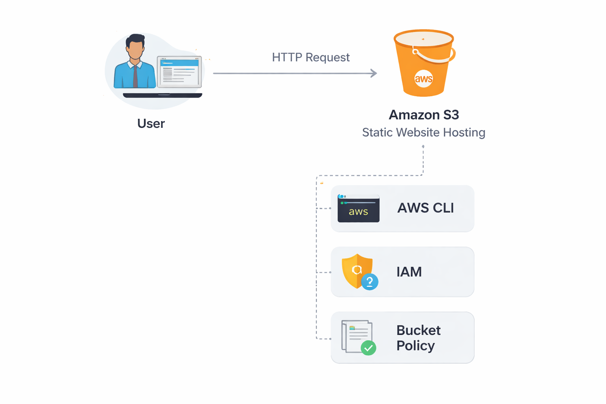
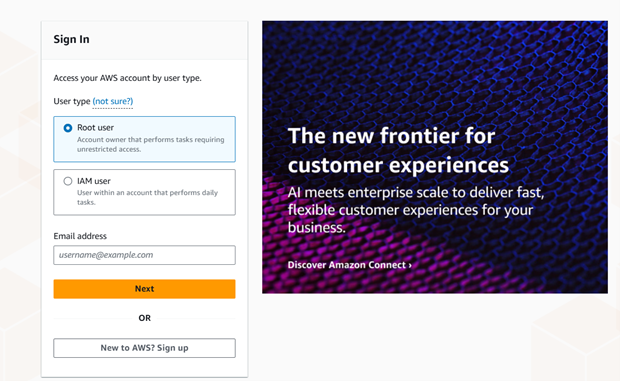
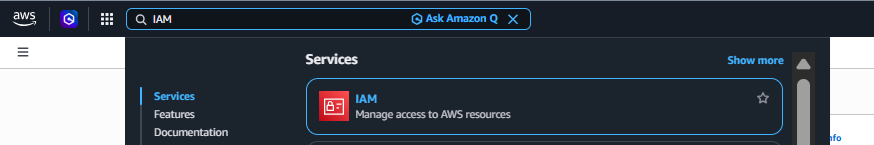

# AWS S3 Static Website Hosting (CLI Project)


## Project Description

This project demonstrates how to deploy a static website using Amazon S3 and AWS CLI.

The project is based on a guided lab, but it was fully adapted and implemented in a personal AWS account. Several modifications were required to replicate the lab environment, including manual configuration of IAM users, CLI setup, and S3 permissions.

---

## The goal of this project is to understand how to:

- Deploy a static website using Amazon S3
- Use AWS CLI for resource management
- Configure IAM users and access keys
- Understand and apply bucket policies
- Troubleshoot real-world AWS permission issues

## Architecture

User (Browser)
│
│ HTTP Request
▼
Amazon S3 Bucket (Static Website Hosting)



## AWS Services Used

| Service | Purpose |
|--------|--------|
| Amazon S3 | Static website hosting |
| AWS CLI | Resource management |
| IAM | User and access management |
| HTML/CSS Template | Website content |

## Prerequisites

Before starting this project, the following requirements are needed:

- An active AWS account
- Basic knowledge of Linux commands
- IAM user with programmatic access (Access Key & Secret Key)
- A terminal environment (e.g., VS Code, Codespaces, or local machine)
- Internet connection

Optional:
- Basic understanding of cloud computing concepts

## 🚀 Steps Overview

1. Create an IAM user with programmatic access
2. Install and configure AWS CLI
3. Create an S3 bucket
4. Disable Block Public Access settings
5. Apply a bucket policy for public read access
6. Upload static website files to S3
7. Enable static website hosting
8. Verify deployment and access the website

## Implementation Steps
 1. Log in to the AWS Management Console using the root user.
    
    
 3. Navigate to IAM.


 5. From the left panel, select **Users**.
 6. Click on **Create user** in the top right corner.
 7. Enter a username and click **Next**.
 8. Select **Attach policies directly** under Permissions options.
 9. Search for and select **AmazonS3FullAccess**, which allows performing all required S3 operations.
 10. Click **Next**, then click **Create user**.
---
To enable CLI access:

9. Go back to **Users** and select the created user.
10. Navigate to **Security credentials**.
11. Under **Access keys**, click **Create access key**.
12. Select **Command Line Interface (CLI)** as the use case and click **Next**.
13. Confirm the recommendation checkbox and click **Next**
14. Optionally add a description, then click **Create access key**.
15. Save the **Access Key ID** and **Secret Access Key** securely, as they will be used for CLI authentication.
16. Click **Done** to finish.
---

After completing this configuration, the IAM user can be used from a CLI environment. For this project, a VS Code terminal provided by GitHub Codespaces is used.

To begin, install the AWS CLI in the terminal.

---
17. Download the installation file:
```bash
curl "https://awscli.amazonaws.com/awscli-exe-linux-x86_64.zip" -o "awscliv2.zip"
```
18. Unzip website the downloaded file:
```bash
unzip awscliv2.zip
```
19. Install the AWS CLI:
```bash
sudo ./aws/install
```
20. Verify the installation:
```bash
aws --version
```
---
After installing the CLI, configure it to use the IAM user that was created.

21. Run the following command:
```bash
aws configure
```
22. Enter the following information:

- Access Key ID (generated when creating the user)
- Secret Access Key (generated when creating the user)
- Default region (the AWS region where the resources will be created and managed)
- Output format (in this case, json)

23. To verify that the configuration was successful and that the CLI is properly authenticated, run:
```bash
aws sts get-caller-identity
```
This command returns a JSON output confirming the active identity and connection.

---
After successfully configuring and connecting the IAM user to the AWS CLI, we can begin working.

24. Create an S3 bucket using the following command, specifying the bucket name and the desired region:
```bash
aws s3 mb s3://<bucket-name> --region <region>
```
---
Since this bucket will host a static website, it must be publicly accessible. By default, S3 buckets are created as private, so the public access settings must be modified.

25. Run the following command to disable the block public access configuration:
```bash
aws s3api put-public-access-block \
--bucket <bucket-name> \
--public-access-block-configuration \
BlockPublicAcls=false,IgnorePublicAcls=false,BlockPublicPolicy=false,RestrictPublicBuckets=false
```
26. To verify that the bucket allows public access, run:
```bash
aws s3api get-public-access-block --bucket <bucket-name>
```
If the output shows all values set to **false**, it means that public access is enabled for the bucket.

---
To upload the website, a local copy of the files is required, since the lab environment does not provide access to them externally. You can either use your own files or download a template from the web, for example from https://html5up.net/, and store it locally.

27. After adding the file, extract its contents using the  command:
```bash
unzip
```
Store the extracted files in a new directory:
28. Create a new directory using the command:
```bash
mkdir website
```
29. Move the extracted files into this directory using the command:
```bash
mv * website/
```
To upload the static website files:
30. Navigate to the directory that contains the extracted files using the command:
```bash
cd website
```
31. Inside the directory, run the following command to upload the files to the S3 bucket:
```bash
aws s3 cp . s3://<your-bucket-name> --recursive
```
32. To verify that the files were uploaded successfully, run:
```bash
aws s3 ls s3://<your-bucket-name>
```
To allow external access to the website files, a bucket policy must be applied that grants public read permissions to all objects in the bucket.
33. Run the following command:
```bash
aws s3api put-bucket-policy \
--bucket <your-bucket-name> \
--policy '{
  "Version":"2012-10-17",
  "Statement":[{
    "Effect":"Allow",
    "Principal":"*",
    "Action":"s3:GetObject",
    "Resource":"arn:aws:s3:::<your-bucket-name>/*"
  }]
}'
```
34. To configure the bucket for static website hosting, run:
```bash
aws s3 website s3://<your-bucket-name> --index-document index.html
```
35. Verify that the bucket is configured for static website hosting by running the following command:
```bash
aws s3api get-bucket-website --bucket <your-bucket-name>
```
If a valid JSON output is returned, it means the configuration was successful.

---
Once the website is configured, go to Amazon S3 in the AWS Management Console to obtain the website URL.

36. Open the bucket you created.
37. Navigate to the **Properties** tab.
38. Scroll down to the **Static website hosting** section.
39. Copy the endpoint URL provided and open it in your browser to access the website.

## What I Learned

- How to configure Amazon S3 for static website hosting
- How to manage AWS resources using AWS CLI
- How IAM users and permissions work in real scenarios
- How to troubleshoot Access Denied (403) errors
- The importance of bucket policies and public access configuration
- 
  ## ⚠️ Challenges Faced

- 403 Forbidden error due to blocked public access
- Missing website files outside the lab environment
- Manual configuration of IAM and CLI without preconfigured resources

## ✅ Solutions Implemented

- Disabled Block Public Access settings
- Applied bucket policy for public read access
- Used an external template to replace missing lab files

## Future Improvements

- Integrate Amazon CloudFront for content delivery (CDN)
- Add a custom domain with Route 53
- Enable HTTPS using SSL/TLS certificates
- Automate deployment using scripts or Infrastructure as Code (IaC)
- Improve security by restricting public access using advanced configurations

## Author

Miguel Bocanegra

